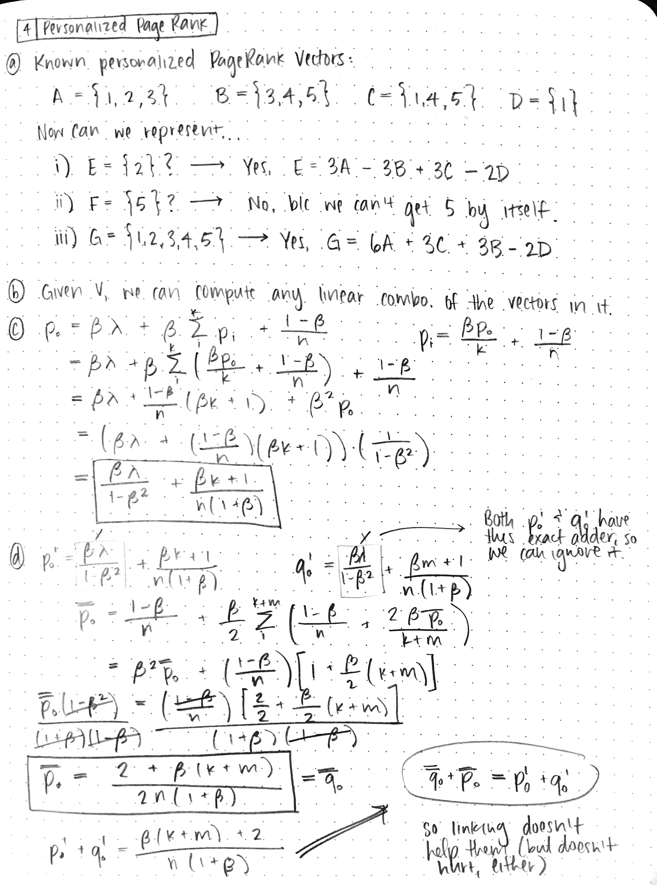

Devon Zuegel &nbsp; // &nbsp; 21 Oct 2015 &nbsp; // &nbsp; CS 224W

# Problem Set 2 #

*Spoke with John Luttig and Ilan Goodman while working on this pset.*

## Problem 1 :: Broadcasting the Network (25 points) ##

### Part A ###


<!--BREAK-->
### Part B ###


For any events $A_1$, $A_2$:

$$P(A_1 \cup A_2) ≤ P(A_1) + P(A_2)$$

The probability of the event that we get caught by node `i`:

$$P(A_i(t_i)) = t_i^\beta$$

Let `P(A)` be the probability that we get caught by one or more nodes:

$$\begin{align}
A    &= A_1(t_1) \cup A_2(t_2) \cup ... \cup A_2(t_2) \\\\
P(A) &≤ P(A_1) + P(A_2) + ... + P(A_2) \\\\
     &≤ \sum_{i = 1}^{n} {P(A_i)} = \sum {t_i^\beta} \space \space \blacksquare
\end{align}$$

<!--BREAK-->
### Part C ###


<!--BREAK-->
### Part D ###

NOTE: It is not possible to have an undirected graph without self-loops with distinct degrees. However, for the sake of solving this problem we should maintain this assumption until the end.

##### Thoughts #####

- Constraints:
    + $0 ≤ t_i ≤ 1$ since the intervals are $1$ unit of time long
    + $\sum_i t_{i} ≤ \gamma < 1$
- Considering the case where all degrees are the same, we would want to bug each node for the same amount of time.
- If you have three companies that have a certain rates `(r1,r2,r3)` of return  on your investment (all of them have zero risk), how would you invest your money?
    + You would invest all of your money into the company with the highest return rate.
    + If you had a constraint that said you could invest at most half of your money in any given company, you'd put half into the company with the best return and half into the one with the second-best return.


##### Answer #####

In the case where all node degrees are distinct, there exists a single node `n` whose degree `d` is greater than that of all other nodes in the network. Now let's consider some tiny amount of time `x`, which we can use to bug incoming messages of a single node in the network. We'd get most "bang for our buck" if we spent that `x` time at `n`, because it has `d` potential incoming messages at any given time. Thus, we want to spend every unit of time possible at that highest degree node. We can spend at most `1` unit at any given node since the interval is of length `1`, but since `\gamma < 1`, we don't have to worry about distributing it according to that original constraint since we don't have `> 1` unit of time to spend.

## Problem 2 :: Signed Triad Analysis (15 points) ##

### Part A ###

`{-6: 58622, 2: 450636, -2: 395357, 6: 3978926}`

- **3 negative edges:** 58,622 triads (01.2%)
- **3 positive edges:** 3,978,926 triads (81.5%)
- **2 postive, 1 negative:** 450,636 triads (09.2%)
- **2 negative, 1 positive:** 395,357 triads (08.1%)

<!--BREAK-->
### Part B ###

Calculated in `hw2p2a.py`:
```python
number of positive edges = P = 592,551
number of negative edges = N = 119,232
total number of edges    = T = 711,783
p = P / T = 592,551 / 711,783 = .832    # Fraction of positive
```

Probability of...

- **3 negative edges:** `3(1 - p)^3 = .47%`
- **3 positive edges:** `3p^3 = 57.69%`
- **2 postive, 1 negative:** `3(1 - p)p^3 = 34.83%`
- **2 negative, 1 positive:** `3p(1 - p)^3 = 07.01%`

<!--BREAK-->
### Part C ###

The rankings for most probable to least probable triad type are consistent in our expected and actual results. However, there are two critical differences:

- We expected to see all-positive triads < 60% of the time, but in reality we saw them more than 80% of the time!
- We expected to see 2 positive, 1 negative triads > 30% of the time, but in reality we only saw it 9% of the time!

One hypothesis for this shift is the idea in psychology called "The Norm of Reciprocity", which is "the expectation that people will respond favorably to each other by returning benefits for benefits" (Wikipedia). Another hypothesis is that there's a social cost associated with negatively reviewing someone, so people tend to do it less frequently in tighter-knit social circles (a.k.a. those that tend to create a disproportionate amount of the triads).

## Problem 3 :: Decentralized Search (40 points) ##

### Part A ###

**Setup:**

- `T` = complete, perfectly-balanced `b`-nary tree
    + each node has `b` children
    + `b ≥ 2`
- `N` = # of network nodes
- `h(T)` = height of `T`

**Thoughts:**

- number of leaves grows by a factor of `b` each time the height increases
- the number of leaves on a tree `N` of height `h` is $b^{h}$

$$\begin{align}
N    &= b^{h(T)} \\\\
h(T) &= \log_b N
\end{align}$$

<!--BREAK-->
### Part B ###

The maximum possible value of `h(v, w)` occurs when the ancestor common to `v` and `w` is the root of the original tree `T`. Therefore, this max value is the height of `T`, which we showed in part (a) to be $h(v, w) = \boxed{log_b N}$

<!--BREAK-->
### Part C ###

Say that `T_{v, d}` is our subtree that contains the desired height `d` and node `v`. `T_{v,d} − T_{v,d−1}` satisfies `h(v, w) = d`, and the number of leaves of a tree of height `h(T)` is $b^{h(T)}$. Thus, there are $b^{d} − b^{d−1}$ nodes satisfying h(v, w) = d.

<!--BREAK-->
### Part D ###

**Goal:**
Prove the following:  $$Z = \sum_{w ≠ v} b^{-h(h,w)} ≤ log_b N$$

**Thoughts:**

- $$    p_v(w) = \dfrac{1}{Z} b^{-h(h,w)} \rightarrow Z = \dfrac{1}{p_v(w)} \cdot b^{-h(h,w)}     $$
- In part c we figured out that there are `b^i - b^(i - 1)` nodes `w` such that `h(v, w) = i`.

**Answer:**

$Z = \sum_{w ≠ v} b^{-h(h,w)}                  $

$\space\space  = \sum_{w ≠ v} b^{-i}                  $

We can rearrange this and look at each level of the tree as our summation instead of looking at every `w ≠ v`. It is equivalent to consider each level `i` from `1` to $log_b N$ if we multiple each step by the number of "`w`s" exist at each level (which we figured out in part c):

$\space\space  = \sum_{i = 1}^{log_b N} (b^{i} - b^{i-1}) b^{-i}   $

$\space\space  = \sum_{i = 1}^{log_b N} (1 - \frac{1}{b})   $

$\space\space  ≤ log_b N                                   $

<!--BREAK-->
### Part E ###

Setup:

- Let `d = h(v, t)`.
- For any of the $b^{d - 1}$ leaves `u` in `T'`, the following equality holds: `h(v, u) = d`.
- `N(T)` = # of leaves in T'
- `prob` = prob of any 2 nodes connecting

The probability of `v` linking an edge to `u` is $\frac{b^{-d}}{Z}$. Therefore the probability of `v` linking an edge to `T'` is:

$$\begin{align}
N(T) \cdot \text{prob} &= \dfrac{b^{d - 1} \cdot b^{-d}}{Z}     \\\\
&= \dfrac{1}{bZ}    \\\\
&= \dfrac{1}{b \sum_{w ≠ v} b^{-h(h,w)} }    \\\\ \\\\ \\\\
\text{And we know that } Z &≤ log_b N \text{, so we get the following:} \\\\ \\\\
&≥ \dfrac{1}{b \log_b N}
\end{align}$$

<!--BREAK-->
### Part F ###

The probability of `v` having zero edges into `T'` is less than the value of the following expression:

$(1 - \dfrac{1}{b \log_b N})^{c(\log_{b} N)^{2}}$

$= (1 - \dfrac{1}{b \log_b N})^{b(\log_b N)\frac{c}{b}(\log_b N)}$

$= (\dfrac{1}{e})^{\frac{c \ln N}{b \ln b}}$

$= (N)^{- \frac{c}{b \ln b}}$

<!--BREAK-->
### Part G ###

Starting at any given node `v` we can find some some node `u` with `h(u, t) < h(v, t)`. We know already that `h(v, t) < log_b N`, so we also know that we can reach the destination in $O(\log_b N)$ steps.

<!--BREAK-->
### Part H ###

My plot shows that the average search time decreases as alpha grows beyond one (there's a little hump where $\alpha = 1$).

In other words, successful searches tend to finish in fewer steps. The reasoning is that there are fewer ways for things to go wrong, plus the longest possible search is limited by the height of the total tree.

## Problem 4 :: Variations on a Theme of PageRank (25 points) ##


<!--BREAK-->

