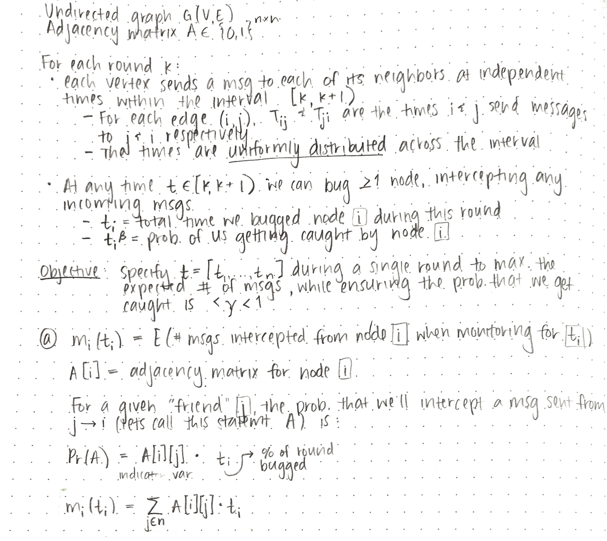
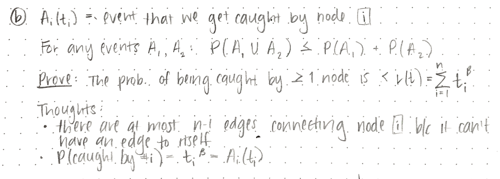
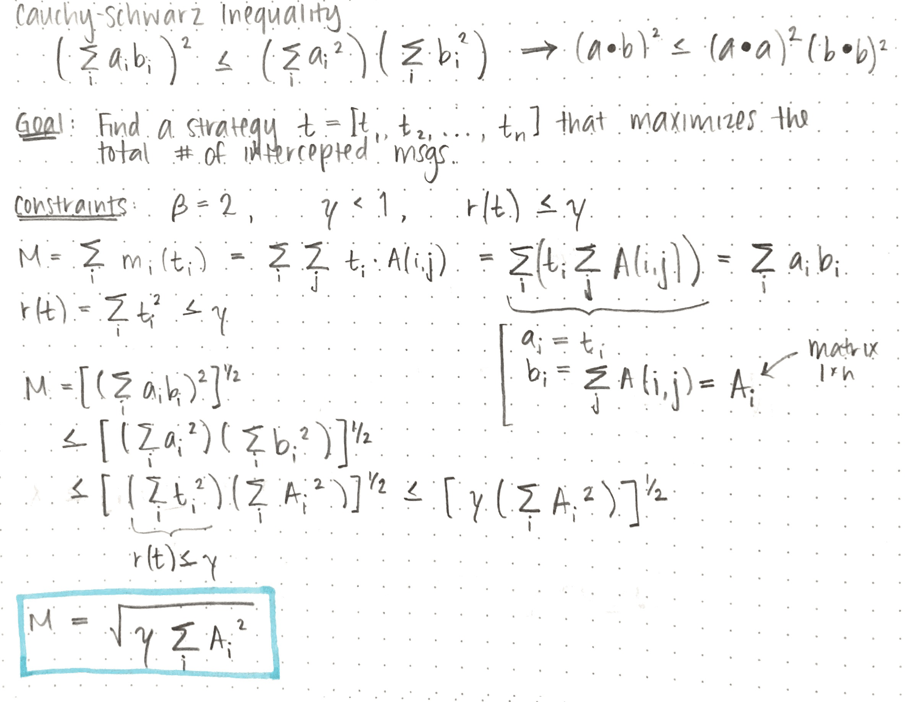
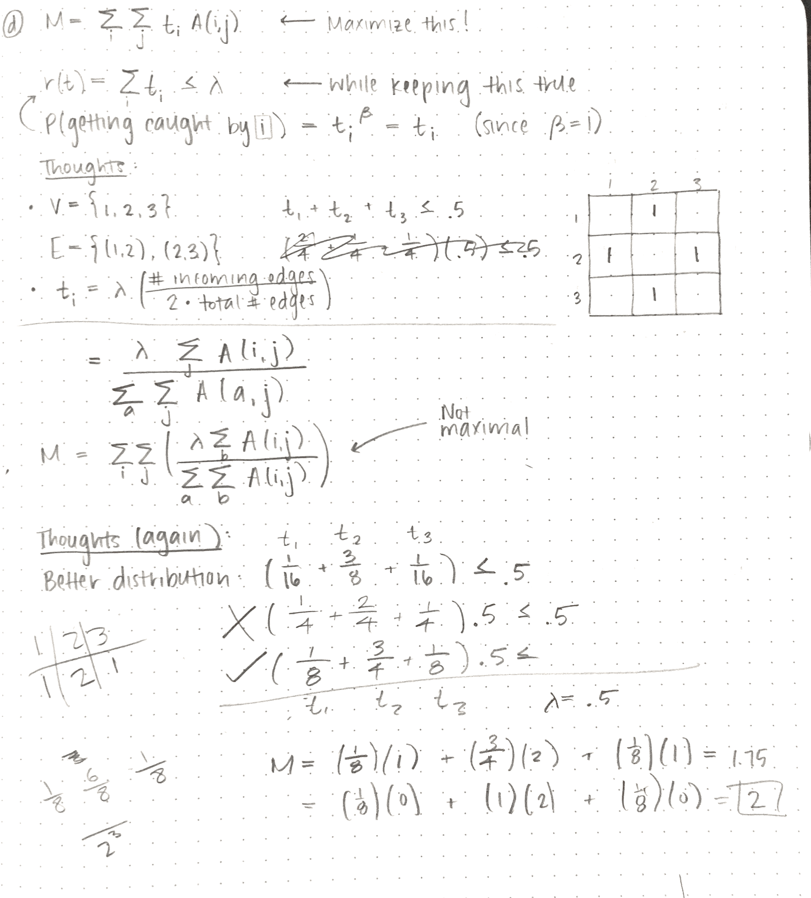

Devon Zuegel &nbsp; // &nbsp; 21 Oct 2015 &nbsp; // &nbsp; CS 224W

# Problem Set 2 #

*Spoke with John Luttig while working on this pset.*

## Problem 1 :: Broadcasting the Network (25 points) ##

### Part A ###



### Part B ###



For any events $A_1$, $A_2$:

$$P(A_1 \cup A_2) ≤ P(A_1) + P(A_2)$$

The probability of the event that we get caught by node `i`:

$$P(A_i(t_i)) = t_i^\beta$$

Let `P(A)` be the probability that we get caught by one or more nodes:

$$\begin{align}
A    &= A_1(t_1) \cup A_2(t_2) \cup ... \cup A_2(t_2) \\\\
P(A) &≤ P(A_1) + P(A_2) + ... + P(A_2) \\\\
     &≤ \sum_{i = 1}^{n} {P(A_i)} = \sum {t_i^\beta} \space \space \blacksquare
\end{align}$$

### Part C ###



### Part D ###

NOTE: It is not possible to have an undirected graph without self-loops with distinct degrees. However, for the sake of solving this problem we should maintain this assumption until the end.

##### Thoughts #####

- Constraints:
    + $0 ≤ t_i ≤ 1$ since the intervals are $1$ unit of time long
    + $\sum_i t_{i} ≤ \gamma < 1$
- Considering the case where all degrees are the same, we would want to bug each node for the same amount of time.
- If you have three companies that have a certain rates `(r1,r2,r3)` of return  on your investment (all of them have zero risk), how would you invest your money?
    + You would invest all of your money into the company with the highest return rate.
    + If you had a constraint that said you could invest at most half of your money in any given company, you'd put half into the company with the best return and half into the one with the second-best return.




##### Answer #####

In the case where all node degrees are distinct, there exists a single node `n` whose degree `d` is greater than that of all other nodes in the network. Now let's consider some tiny amount of time `x`, which we can use to bug incoming messages of a single node in the network. We'd get most "bang for our buck" if we spent that `x` time at `n`, because it has `d` potential incoming messages at any given time. Thus, we want to spend every unit of time possible at that highest degree node. We can spend at most `1` unit at any given node since the interval is of length `1`, but since `\gamma < 1`, we don't have to worry about distributing it according to that original constraint since we don't have `> 1` unit of time to spend.

### Part E (extra credit) ###

> TODO

## Problem 2 :: Signed Triad Analysis (15 points) ##

### Part A ###

> TODO

### Part B ###

Calculated in `hw2p2a.py`:
```python
number of positive edges = P = 592,551
number of negative edges = N = 119,232
total number of edges    = T = 711,783
p = P / T = 592,551 / 711,783 = .832    # Fraction of positive
```

Probability of...

- **3 negative edges:**       $ \dfrac {\binom{N}{3}} {T} =  $
- **3 positive edges:**       $ \dfrac {\binom{P}{3}} {T} =  $
- **2 postive, 1 negative:**  $ \dfrac {\binom{P}{2} \cdot \binom{N}{1}} {T} =  $
- **2 negative, 1 positive:** $ \dfrac {\binom{N}{2} \cdot \binom{P}{1}} {T} =  $

### Part C ###

> TODO

## Problem 3 :: Decentralized Search (40 points) ##

### Part A ###

**Setup:**

- `T` = complete, perfectly-balanced `b`-nary tree
    + each node has `b` children
    + `b ≥ 2`
- `N` = # of network nodes
- `h(T)` = height of `T`

**Thoughts:**

- number of leaves grows by a factor of `b` each time the height increases
- the number of leaves on a tree `N` of height `h` is $b^{h}$

$$\begin{align}
N    &= b^{h(T)} \\\\
h(T) &= \log_b N
\end{align}$$

### Part B ###

The maximum possible value of `h(v, w)` occurs when the ancestor common to `v` and `w` is the root of the original tree `T`. Therefore, this max value is the height of `T`, which we showed in part (a) to be $h(v, w) = \boxed{log_b N}$

### Part C ###

> TODO fix me!!!!!!!!!!!!!!!!!!!!!!!!!!!!!!!!!!!!!!!!!!!!!!!!!!!!!!!!!!!!!!!!!!!!!!!!!!!!!!!!!!!!!!!!!!!!!!!!!!!!!!!!!!!!!!!!!!!!!!!!!!!!!!!!!!!!!!!!!!!!!!!!!!!!!!!!!!!!!!!!!!!!!!!!!!!!!!!!!!!!!!!!!!!!!!!!!!!!!!!!!!!!!!!!!!!!!!!!!!!!!!!!!!!!!!!!!!!!!!!!!!!!!!!!!!!!!!!!!!!!!!!!!!!!!!!!!!!!!!!!!!!!!!!!!!!!!!!!!!!!!!!!!!!!!!!!!!!!!!!!!!!!!!!!!!!!!!!!!!!!!!!!!!!!!!!!!!!!!!!!!!!!!!!!!!!!!!!!!!!!!!!!!!!!!!!!!!!!!!!!!!!!!!!!!!!!!!!!!!!!!!!!!!!!!!!!!!!!!!!!!!!!!!!!!!!!!!!!!!!!!!!!!!!!!!!!!!!!!!!!!!!!!!!!!!!!!!!!!!!!

Say that `T_{v, d}` is our subtree that contains the desired height `d` and node `v`. It is easy to see that the leaves of $T_{v,d} − T_{v,d−1}$ satisfy `h(v, w) = d`. Since the number of leaves of a tree of height `h(T)` is $b^{h(T)}$, there are $b^d − b^{d−1}$ nodes satisfying h(v, w) = d.

### Part D ###

**Goal:**
Prove the following:  $$Z = \sum_{w ≠ v} b^{-h(h,w)} ≤ log_b N$$

**Thoughts:**

- $$    p_v(w) = \dfrac{1}{Z} b^{-h(h,w)} \rightarrow Z = \dfrac{1}{p_v(w)} \cdot b^{-h(h,w)}     $$
- In part c we figured out that there are `b^i - b^(i - 1)` nodes `w` such that `h(v, w) = i`.

**Answer:**

$Z = \sum_{w ≠ v} b^{-h(h,w)}                  $

$\space\space  = \sum_{w ≠ v} b^{-i}                  $

We can rearrange this and look at each level of the tree as our summation instead of looking at every `w ≠ v`. It is equivalent to consider each level `i` from `1` to $log_b N$ if we multiple each step by the number of "`w`s" exist at each level (which we figured out in part c):

$\space\space  = \sum_{i = 1}^{log_b N} (b^{i} - b^{i-1}) b^{-i}   $

$\space\space  = \sum_{i = 1}^{log_b N} (1 - \frac{1}{b})   $

$\space\space  ≤ log_b N                                   $

### Part E ###

> TODOOOOOOOOOOOOOOOOOOOOOOOOOOOOOOOOOOOOO

Let `d = h(v, t)`. For any of the $b^{d - 1}$ leaves `u` in `T'`, we have `h(v, u) = d`. The probability of `v` linking an edge to `u` is $\frac{b^{-d}}{Z}$. Therefore the probability of `v` linking an edge to `T'` is:

- `N(T)` = # of leaves in T'
- `prob` = prob of any 2 nodes connecting

$$\begin{align}
N(T) \cdot \text{prob} &= \dfrac{b^{d - 1} \cdot b^{-d}}{Z}     \\\\
&= \dfrac{1}{bZ}    \\\\
&= \dfrac{1}{b \sum_{w ≠ v} b^{-h(h,w)} }    \\\\ \\\\ \\\\
\text{And we know that } Z &≤ log_b N \text{, so we get the following:} \\\\ \\\\
&≥ \dfrac{1}{b \log_b N}
\end{align}$$

### Part F ###

> TODO

### Part G ###

> TODO

### Part H ###

> TODO

## Problem 4 :: Variations on a Theme of PageRank (25 points) ##

### Part A ###

> TODO

### Part B ###

> TODO

### Part C ###

> TODO

### Part D ###

> TODO

### Part E ###

> TODO
