Devon Zuegel &nbsp; // &nbsp; 3 Nov 2015 &nbsp; // &nbsp; CS 224W

# Problem Set 3 #

*Spoke with John Luttig and Ilan Goodman while working on this pset.*

## Problem 1 (10 points) ##

### Parts A & B ###

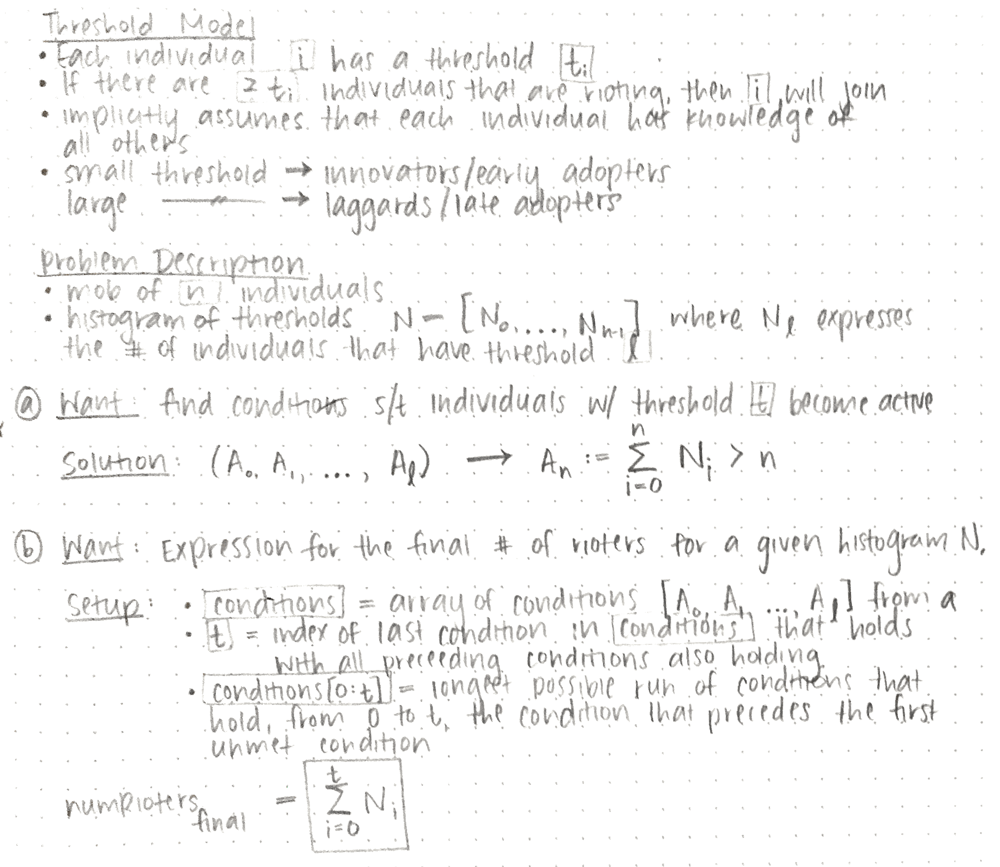

<!--BREAK-->

### Part C ###

We would have 45 cumulative rioters. Output from `1c.py`:

```md
Cumulative total # of rioters would be: 45
```

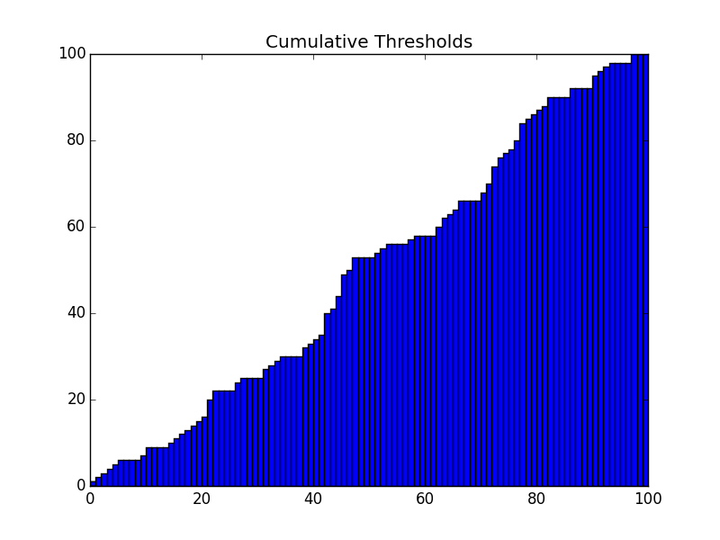

<!--BREAK-->

## Problem 2 (40 points) ##

### Parts A, B, and C ###

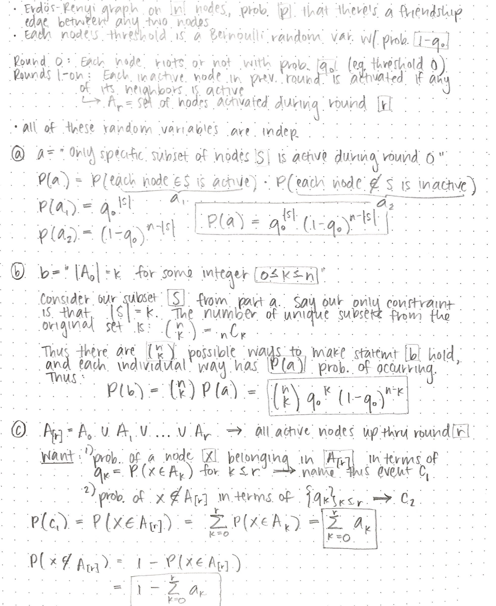

<!--BREAK-->

### Parts D, and E ###

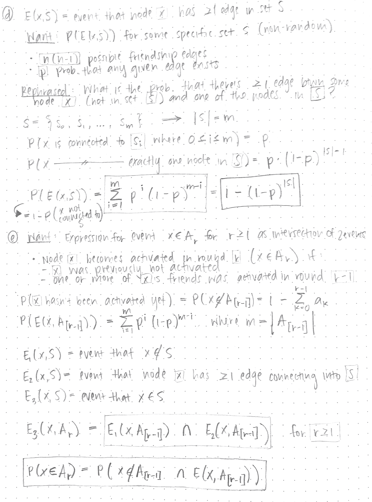

<!--BREAK-->

### Part F ###

Basically we're looking for `1 - P('x is not connected to S and was not activated in rounds 0-r')`:

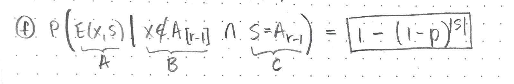

<!--BREAK-->

### Part G ###

#### Want: ####

- $q_r$, the probability that a give node riots in round `r`

#### Known: ####

- **NOTE:** Latex was doing something weird with the subscripts, so there are a few occurrences where I wrote $A[r - 1]$ to mean $A_{[r - 1]}$.

- Bayes' Rule:
    + $$ P(X \text{ | } Y) = \dfrac{P(Y \text{ | } X) \cdot P(X)}{P(Y)} $$
    
    + $$ P(X \text{ | } YZ) = \dfrac{P(A \text{ | } C) \cdot P(B \text{ | } AC)}{P(B \text{ | } C)} $$

- $$ P \big(x \in A_r \big) = P\bigg(x \in A_{[r - 1]} \text{ } \cap E(x, A[r-1]) \bigg)$$

- $$\begin{align}
        P \Big(E(x, S) \text{ | } x \notin A_{[r]} \cap S = A_r \Big)
                          &= \boxed{1 - (1 - p)^{|S|}} \\\\
                          &= \sum_k^{|S|}\Bigg( p^{k} (1-p)^{|S| - k} \binom{|S|}{k} \Bigg)
\end{align}$$

- $$ P \Big(X \notin A_{[r]} \Big) = 1 - \sum_k^{r} q_k $$

- $$\begin{align}
    P \Big( E(x, S) \Big) &= \sum_k^{|S|} p^{i} (1 - p)^{|S| - i} \\\\
                          &= \boxed{1 - (1 - p)^{|S|}}
\end{align}$$

- $$ P\Big( S = A_{[r-1]} \text{ | } x \notin A[r-1] \Big) = P(Z \text{ | } Y) $$

-   $$\begin{align}
        X &= E(x, S)  \\\\
        Y &= \text{event that } x \notin A{[r-1]} \\\\
        Z &= \text{event that } S = A_{r - 1}
    \end{align}$$

- 

- `n` = # of nodes in the entire graph
- We only have to consider the event that `x` is connected to a node activated in the last round `r - 1`, because if it were connected to a node activated in any earlier round then it would be activated too (a.k.a. `x ∈ `$A_{[r-1]}$).

#### Solution: ####

$$\begin{align}
q_r &= P \Big( x \notin A{[r-1]} \cap E(x, A_{r-1}) \Big) \\\\
    &= P(A \cap B ) = P(B \text{ | } A) \cdot P(A) \small{\qquad \texttt{ # Bayes Rule}}
\end{align} $$

$$\begin{align}
    &= P\Big(E(x, A_{r-1}) \text{ | } x \notin A{[r-1]} \Big) \cdot P \Big( x \notin A{[r-1]} \Big) \\\\
\end{align} $$

$$\begin{align}
    &= P\Big(E(x, A_{r-1}) \text{ | } x \notin A{[r-1]} \Big) \cdot \Big(1 - \sum_k^{r - 1} q_k \Big)
\end{align} $$

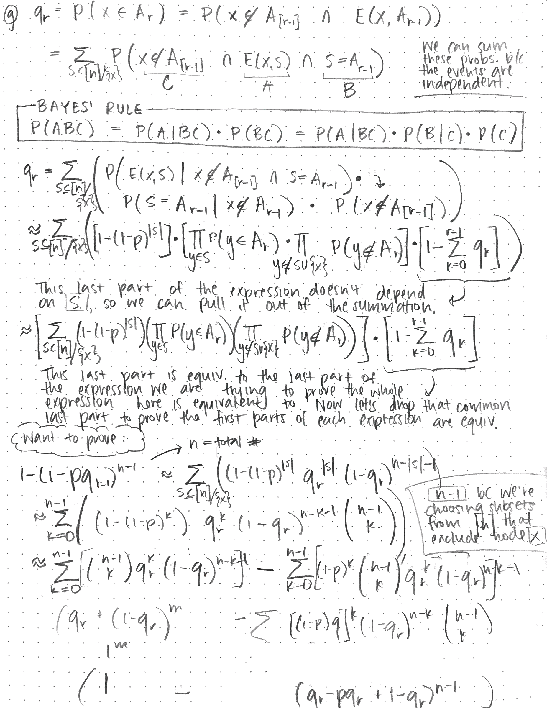

<!--BREAK-->

### Part i ###

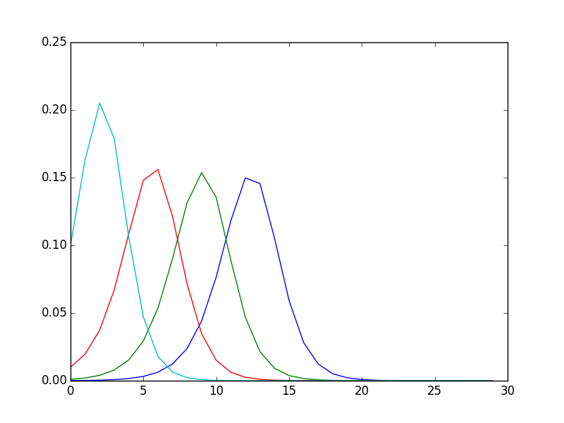

| Color  | $q_0$ value |
| ------ | ----------- |
| blue   |    0.0001   |
| green  |    0.001    |
| red    |    0.01     |
| cyan   |    0.1      |

Each curve follows the same basic up-and-then-down shape. This makes sense, because at the beginning, there are few activated nodes. Then that number grows exponentially for several iterations because neighbor nodes activated in each subsequent round expand the frontier to exponentially more neighbor nodes. However, at some point this drops off as there are no other nodes in the connected component to activate. As the number of iterations goes to infinity, each marginal iteration adds no new nodes.

It makes sense that our curve with the highest $q_0$ starts at the highest point and then peaks and drops off the soonest. When the $q_0$ is high, the initial number of activated nodes is highest, and activation spread quickly through the graph. Conversely, it makes sense that the curve with the lowest $q_0$ starts at the lowest point, with very few initially activated nodes. Then, it rises steadily and peaks latest, since the others had a "head start" on it.

<!--BREAK-->

### Part ii ###
```
q0 = 0.0001   =>   Q29 = 0.796797231978
q0 = 0.001    =>   Q29 = 0.79710527594
q0 = 0.01     =>   Q29 = 0.800156416064
q0 = 0.1      =>   Q29 = 0.828251158185
```

The $Q_{29}$ value for a particular starting $q_0$ is the sum of the probabilities that a given node `x` will be activated in round `0`, `1`, ..., `29`. As we can see from the plot in part i, the probability that `x` will be activated in round `i` goes to `0` as `i`$\rightarrow \infty$. This occurs well before `i = 30` for all four starting values of $q_0$.

For all intents and purposes, we can say that the probability that `x` will be activated in round `i > 29` is zero. Thus, we can see that **$Q_{29}$ represents the probability that `x` will be activated during the cascade**

$Q_{29}$ is well under `1.00`, which means that a random node `x` has approximately a `20%` chance of never being activated. This can only happen if the graph is unconnected. Otherwise, `x` would eventually be reached by an expansion of the frontier.

<!--BREAK-->

### Part iii ###

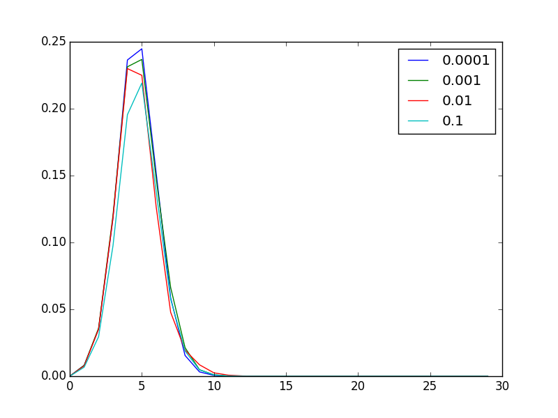

None of the graphs were connected. Output from `2iii.py`:

```md
0 of the 40 graphs with q_0 = 0.0001 were connected
0 of the 40 graphs with q_0 = 0.001  were connected
0 of the 40 graphs with q_0 = 0.01   were connected
0 of the 40 graphs with q_0 = 0.1    were connected
```

I was surprised to discover that none of the graphs were connected. This likely contributed to the lower `q` values in our simulations as compared to those we computed theoretically. We don't account for this lack of connectivity in our theoretical equation, hence its dissimilarity with our simulations.

<!--BREAK-->

### Part iv ###

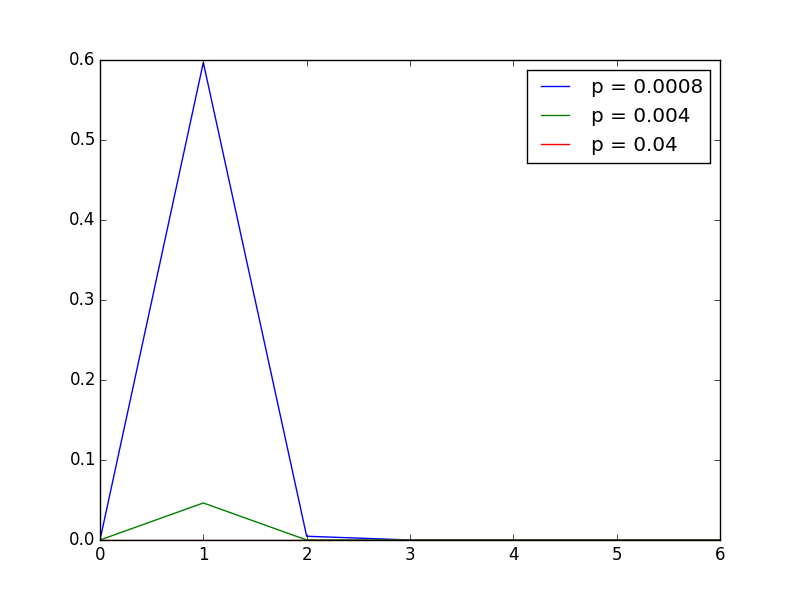

**Diameters:**

```md
q_0 = 0.0001 =>
  diameters = [32, 27, 28, 32, 30, 27, 28, 33, 30, 30, 28, 28, 31, 30, 31, 28, 31, 30, 34, 30, 29, 29, 29, 29, 27, 27, 28, 27, 29, 32, 28, 30, 31, 31, 33, 30, 32, 31, 29, 30]
  max diameter = 34
  min diameter = 27

q_0 = 0.001 =>
  diameters = [29, 30, 28, 28, 30, 30, 31, 30, 31, 27, 27, 27, 31, 30, 29, 32, 30, 26, 33, 32, 27, 29, 30, 27, 29, 26, 29, 29, 31, 31, 29, 31, 27, 29, 28, 29, 30, 33, 29, 28]
  max diameter = 33
  min diameter = 26

q_0 = 0.01 =>
  diameters = [34, 28, 30, 29, 29, 31, 32, 27, 31, 33, 31, 30, 32, 30, 27, 31, 31, 27, 29, 27, 30, 30, 26, 31, 28, 33, 29, 28, 31, 31, 30, 32, 27, 28, 31, 29, 30, 32, 29, 31]
  max diameter = 34
  min diameter = 26

q_0 = 0.1 =>
  diameters = [27, 29, 28, 29, 32, 33, 30, 30, 30, 30, 29, 29, 28, 28, 35, 31, 30, 28, 29, 27, 31, 30, 29, 29, 33, 28, 31, 28, 30, 31, 30, 28, 32, 30, 28, 29, 31, 30, 28, 27]
  max diameter = 35
  min diameter = 27
```

<!--BREAK-->

## Problem 3 (25 points) ##

#### Description ####

- 2 possible versions of the social graph of voters. Each graph:
  + has `10,000` nodes, with ids `0 - 9999`
  + is undirected
- 40% for A, 40% for B, 20% undecided
  + if last digit of id is `0 - 3`, node supports B
  + if last digit of id is `4 - 7`, node supports A
  + if last digit of id is `8 - 9`, node is undecided
- 7-day decision period. Each day:
  1. Graphs initialized with every voter's initial state.
  2. For each undecided voter:
    - If strict majority of their friends support B, they support B
    - If strict majority of their friends support A, they support A
    - If equal number of their friends support A and B, we assign their side in alternating fashion (start with A)
      + To handle this, a single global variable should keep track of the current alternating vote type (initialize to A in the first round)
  3. When updating the votes, use values from current iteration.
- NOTE: Decision process doesn't change loyalties of voters who have already made up their minds.

#### Part 1 :: Basic setup & forecasting (5 points) ####

Candidate B wins in both graphs (from files `g1.edgelist.txt` and `g2.edgelist.txt`). In `G1` and `G2`, (s)he wins with a margin of **126** and **174** votes respectively.

Output from `3-1.py`:

```md
The election winner is B, wins by a margin of 126 votes
The election winner is B, wins by a margin of 174 votes
```

<!--BREAK-->

#### Part 2 :: TV Advertising (8 points) ####

Output from `3-2.py`:

```md
Minimum expenditure required to win G1 = $2000
Minimum expenditure required to win G2 = $6000
```

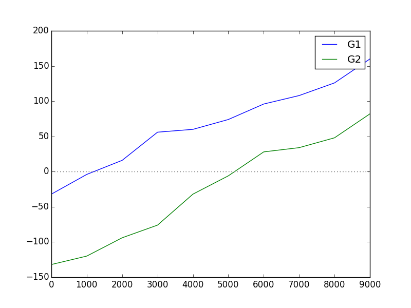

> NOTE: If we only count as undecided those who remain undecided after that round, our required expenditures become `$3,000` and `$5,000` for G1 and G2 respectively. It wasn't clear from the assignment handout how we should count these, so for my real answers I assume that we are counting as undecided those who were undecided before the persuasion round. This doesn't actually end up changing the basic results (i.e. for part c we still can't win in G1, even with this change).

<!--BREAK-->

#### Part 3 :: Wining & dining the high rollers (8 points) ####

Output from `3-3.py`:

```md
No amount of spending will let you win G1 :(
Minimum expenditure required to win G2 = $6000
```

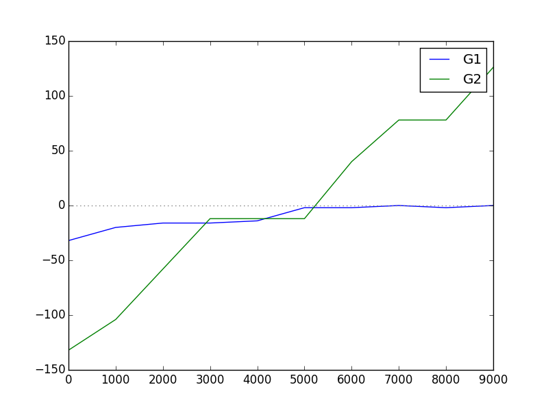

<!--BREAK-->

#### Part 4 :: Analysis (4 points) ####

Graphs 1 and 2 have totally different degree distributions. Running some Snap.py methods on both, it appears that G1 is basically random whereas G2 was created with some form of preferential attachment.

This analysis is consistent with the results from parts 2 and 3. In a random graph, the difference between the highest-degree nodes and lowest-degree ones aren't very different, so targeting the higher-degree ones doesn't buy you much. In a preferentially-attached graph, targeting those nodes that have the highest degree would be immensely helpful, because they have an outsized impact relative to other nodes.

The real world looks more like the preferentially-attached G2, particularly in the realm of political news. There are millions and millions of news sources out there (blogs, newspapers, etc.), but a very small number of them command the attention of the vast majority of eyes. Thus, if I were running a campaign, I would focus my efforts on those major players, following the "high-roller strategy".

<!--BREAK-->

## Problem 4 (25 points) ##

### Parts A & B ###

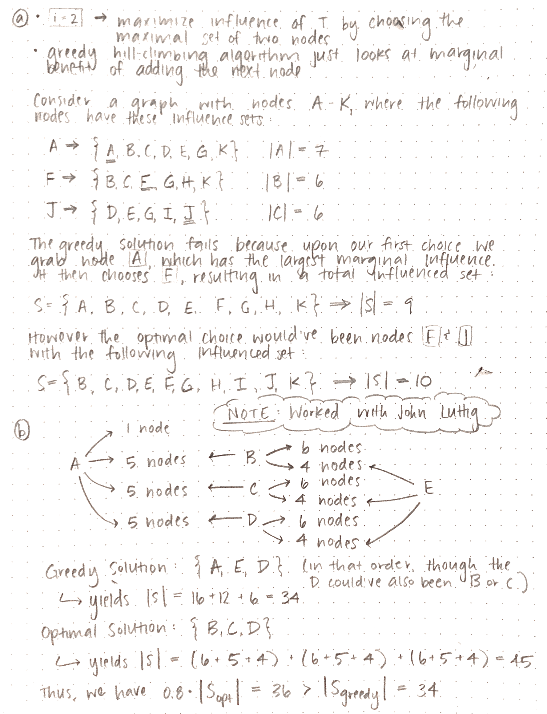

<!--BREAK-->

### Part C ###

One sufficient (but not necessary) property for greedy hill climbing to in fact be optimal is if **every node influences every other node** (i.e. each node's influence set contains all nodes).

<!--BREAK-->

### Part D ###

> NOTE: Worked closely with a TA on this one, because I was really stuck.

Create an infinite number of unconnected, same-sized sub-graphs and say `f(S) = f(T)`. After any infinite number of steps `k`, there remain an infinite number of nodes that can still influence many further nodes.
